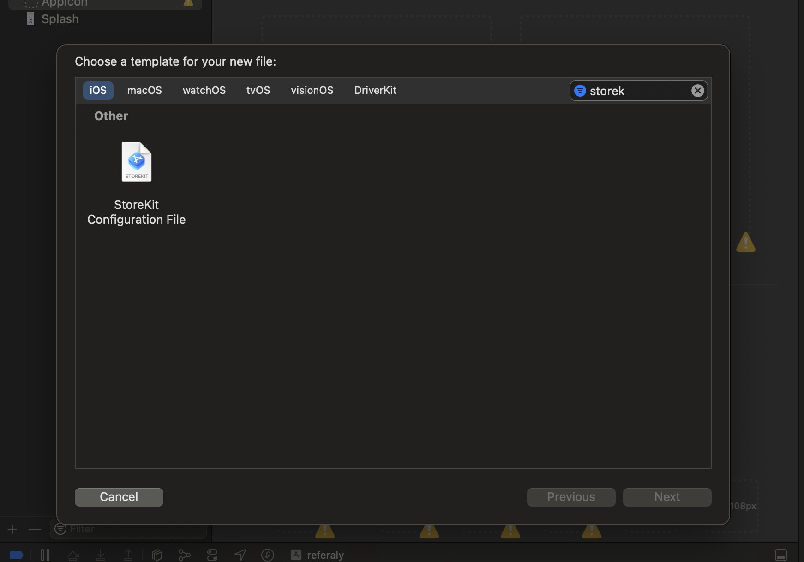
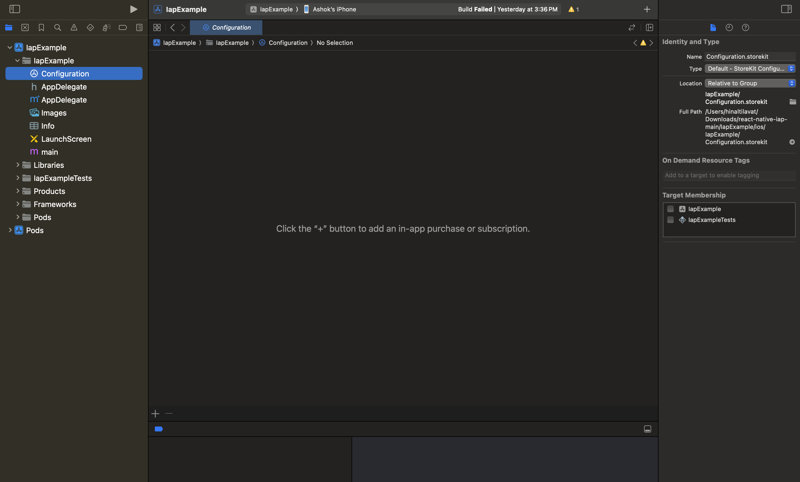
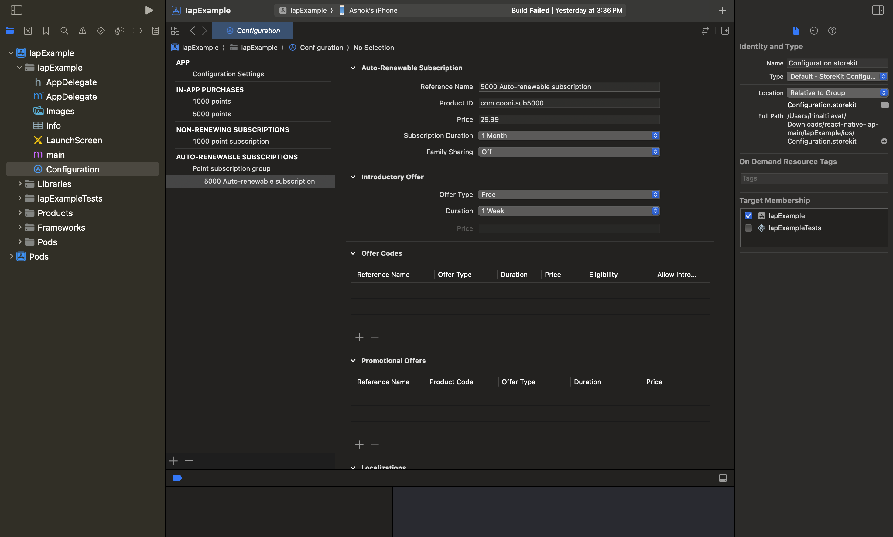
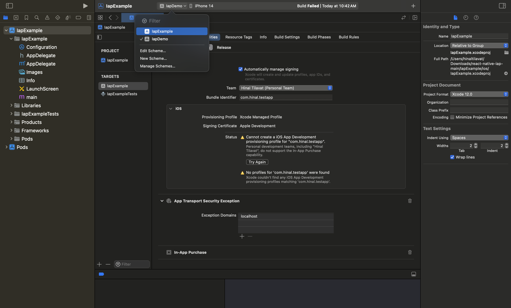
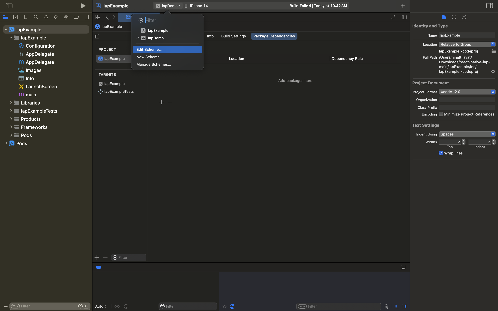
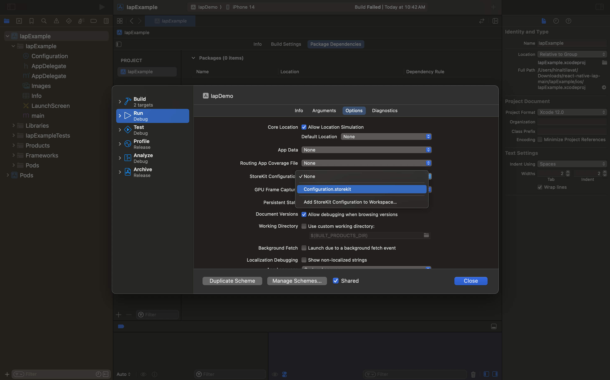

# Adding and Testing StoreKit Configuration in an iOS Project

## Introduction

In this guide, we will walk through the process of adding a StoreKit configuration file to an iOS project and attaching it to an Xcode scheme. This will allow you to test in-app purchases and subscriptions in the simulator.

## Steps to Add a StoreKit Configuration File

### Step 1: Create a StoreKit Configuration File

1. **Open Your Xcode Project:**
   Open your existing Xcode project or create a new one.

2. **Create a New StoreKit Configuration File:**

   - In the Project Navigator, right-click on the folder where you want to create the StoreKit configuration file.
   - Select `New File`.
   - Choose `StoreKit Configuration File` from the list and click `Next`.

     

   - Name your StoreKit configuration file (e.g., `StoreKitConfiguration.storekit`) and click `Create`.

### Step 2: Configure the StoreKit Configuration File

1. **Open the StoreKit File:**
   Open the newly created `.storekit` file in the Project Navigator.

2. **Add Products:**
   - Click the `+` button to add your products (e.g., in-app purchases, subscriptions).
     
   - Configure the details for each product, such as Product ID, Type, and Subscription Group (if applicable).
     

### Step 3: Attach the StoreKit Configuration File to an Xcode Scheme

1. **Open Project Settings:**
   Click on your project in the Project Navigator to open the project settings.

2. **Select the Scheme:**
   Select the `Scheme` you want to configure from the scheme selector next to the `Stop` button in the toolbar.
   

3. **Edit the Scheme:**

   - Click `Edit Scheme`.
   - In the scheme editor, select the `Run` option from the left sidebar.
     

4. **Configure StoreKit Options:**
   - Navigate to the `Options` tab.
   - Under the `StoreKit Configuration` section, click the `Choose StoreKit Configuration File` dropdown and select the StoreKit configuration file you created earlier.
     
   - Click `Close` to save the scheme settings.

### Step 4: Test In-App Purchases in the Simulator

1. **Build and Run Your App:**
   Build and run your app in the simulator.

2. **Trigger In-App Purchase Flow:**
   Trigger the in-app purchase flow in your app. The simulator will use the StoreKit configuration file to simulate the purchase process.

## Conclusion

By following these steps, you'll be able to test in-app purchases using a StoreKit configuration file in the Xcode simulator. This process helps ensure that your in-app purchase logic is functioning correctly before testing on a real device.

## Additional Resources

For more information on StoreKit and in-app purchases, refer to the following resources:

- [Apple Developer Documentation on StoreKit](https://developer.apple.com/documentation/storekit)
- [Testing In-App Purchases with StoreKit Configuration](https://developer.apple.com/documentation/xcode/testing_in-app_purchases_with_storekit_configuration)

## Credits

This file was created with the help of GitHub Copilot.
